# 🚀 Workshop Booking UI/UX Enhancement

## 🌐 Live Demo
🚀 Deployed on Vercel:  
https://workshop-booking-six.vercel.app/

## 📌 Project Overview
This project is an enhanced version of the existing Workshop Booking system developed by FOSSEE. The platform allows coordinators to book workshops and instructors to manage and respond to workshop requests.

The main objective of this task is to improve the User Interface (UI) and User Experience (UX) using React, while preserving the original functionality and workflow of the application.

---

## 🎯 Existing Features
The original system includes:

- Workshop booking and management
- Instructor and coordinator roles
- Workshop statistics and analytics
- Approval/rejection workflow for workshops
- Interactive features like comments and profile stats

---

## ✨ UI/UX Improvements
The following enhancements were implemented:

- Redesigned login and signup interface using React
- Added a responsive and modern navigation bar
- Improved form usability with labels and better input handling
- Enhanced visual hierarchy using spacing, typography, and colors
- Added interactive feedback (hover effects, focus states)
- Optimized layout for mobile devices
- Cleaner and more intuitive user flow

---

## 🎨 Design Principles Used
- Simplicity: Clean and minimal interface for easy navigation
- Consistency: Uniform design across components
- Visual Hierarchy: Proper spacing and font sizes to guide users
- Accessibility: Added labels and improved readability
- User-Centered Design: Focused on improving usability and clarity

---

## 📱 Responsiveness
- Implemented responsive design using CSS media queries
- Optimized layout for smaller screens and mobile devices
- Ensured readability and proper spacing across different screen sizes

---

## ⚖️ Design vs Performance Trade-offs
- Used lightweight CSS instead of heavy UI libraries
- Limited animations to maintain fast performance
- Focused on essential UI improvements without overcomplicating the design

---

## 🧠 Challenges Faced
- Understanding the existing Django-based project structure
- Deciding how much UI to modify while keeping functionality intact
- Ensuring responsiveness across devices

---

## 💡 Approach to Challenges
- Broke the problem into smaller steps
- Focused on UI improvements first, then refined UX
- Used React state management to simulate real interactions

---

## 🛠️ Tech Stack
- Frontend: React.js
- Styling: CSS
- Backend (existing): Django

---

## ⚙️ Setup Instructions

### 1. Clone the repository
git clone https://github.com/lavu-create/Workshop-booking.git
cd Workshop-booking

### 2. Run Backend (Django)
python3 manage.py migrate
python3 manage.py runserver

### 3. Run Frontend (React)
cd frontend
npm install
npm start

---

## 🧠 Reasoning & Design Decisions

### 🎨 What design principles guided your improvements?

The redesign was guided by core UI/UX principles:

- **Simplicity:** The interface was kept clean and minimal to reduce cognitive load for users.
- **Consistency:** Uniform spacing, typography, and color schemes were used across all pages.
- **Visual Hierarchy:** Important actions like login, booking, and navigation were highlighted clearly using size and color contrast.
- **User-Centered Design:** The flow was designed keeping student users in mind, making navigation intuitive and fast.
- **Accessibility:** Labels, readable fonts, and clear input fields were used to improve usability.

### 📱 How did you ensure responsiveness across devices?

Responsiveness was achieved using:

- **Flexible layouts (Flexbox/Grid):** Ensured components adapt to different screen sizes.
- **Relative units (% / vw / vh):** Used instead of fixed pixel values where possible.
- **Mobile-first approach:** UI components were primarily designed and tested for smaller screens first.
- **Adaptive stacking:** Sections automatically stack vertically on smaller devices for better readability.

### ⚖️ What trade-offs did you make between design and performance?

To maintain performance while improving UI:

- Avoided heavy UI libraries (like Material UI or Ant Design)
- Used simple CSS instead of complex animations or frameworks
- Limited animations to keep load time fast
- Focused on lightweight components for charts and UI elements
- Prioritized usability and speed over visual-heavy effects

This ensured the application remains fast, responsive, and efficient.

### 🧩 What was the most challenging part of the task and how did you approach it?

The most challenging part was understanding the existing project structure and improving UI without breaking functionality.

Approach:
- Carefully analyzed the existing React component structure
- Made incremental UI improvements instead of rewriting the codebase
- Tested each section (login, dashboard, statistics) separately
- Focused on maintaining functionality while improving user experience
- Iteratively refined layout and responsiveness issues

---

## 📸 Screenshots

### Before (Original UI)

  <a href="screenshots/before_home.png">
    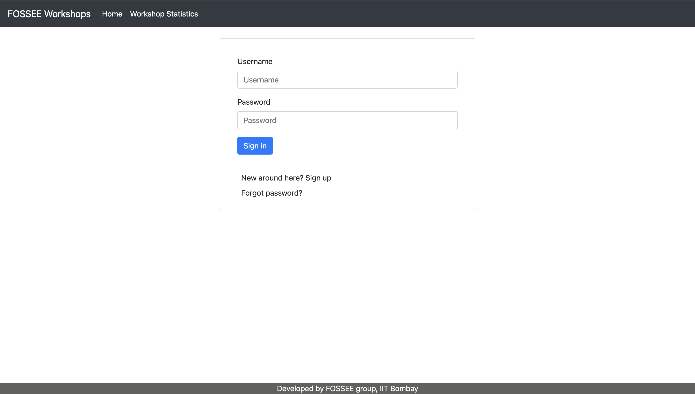
  </a>
  <a href="screenshots/before_signup_1.png">
    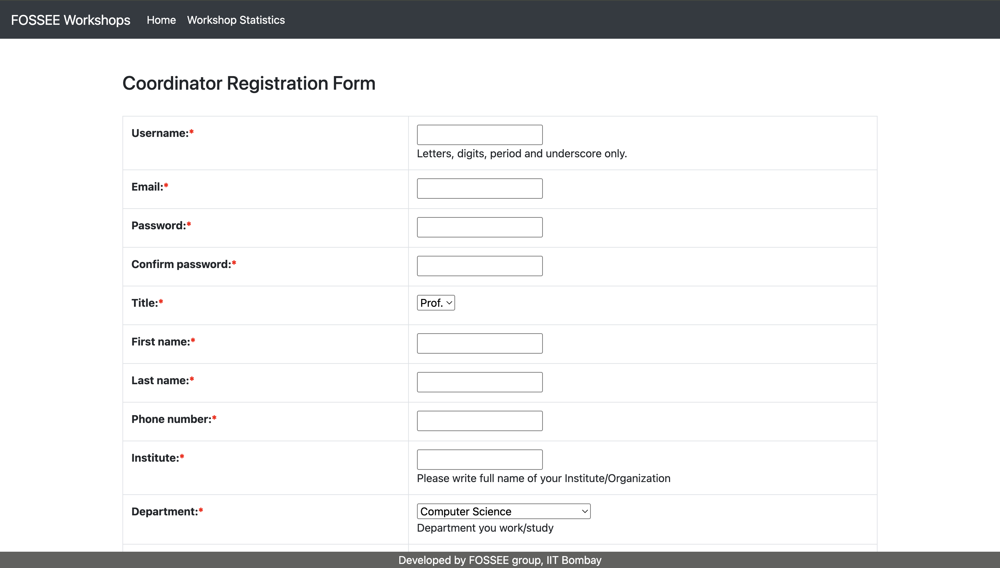
  </a>
  <a href="screenshots/before_signup_2.png">
    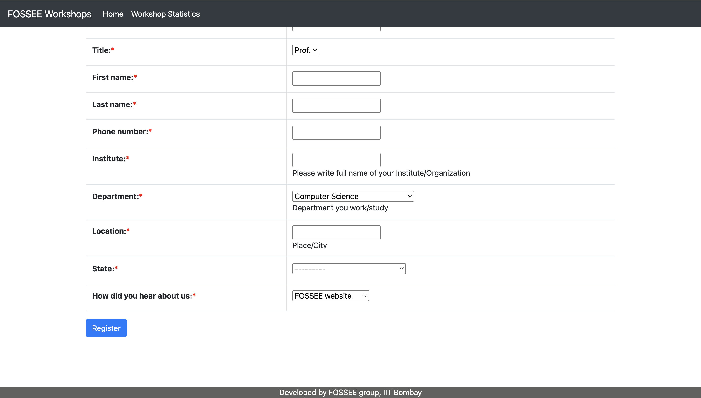
  </a>
  <a href="screenshots/before_after_signup.png">
    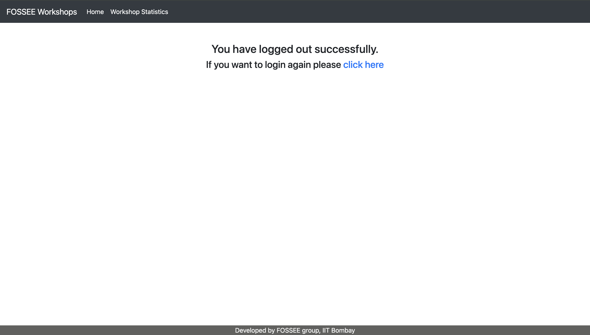
  </a>
  <a href="screenshots/before_forgot_password.png">
    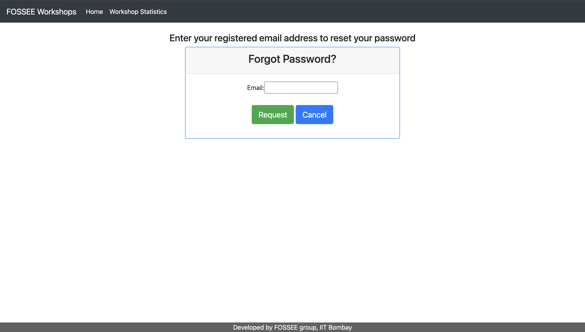
  </a>
  <a href="screenshots/before_workshop_statistics.png">
    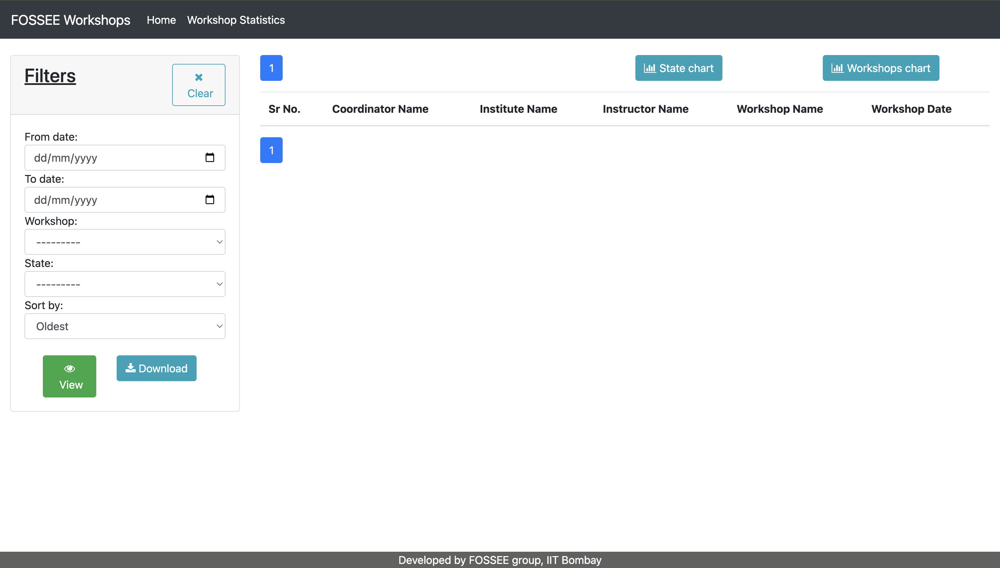
  </a>

### After (Improved UI)

  <a href="screenshots/after_login.png">
    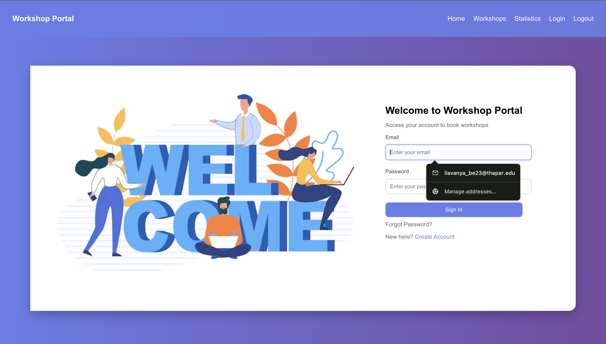
  </a>
  <a href="screenshots/after_signup.png">
    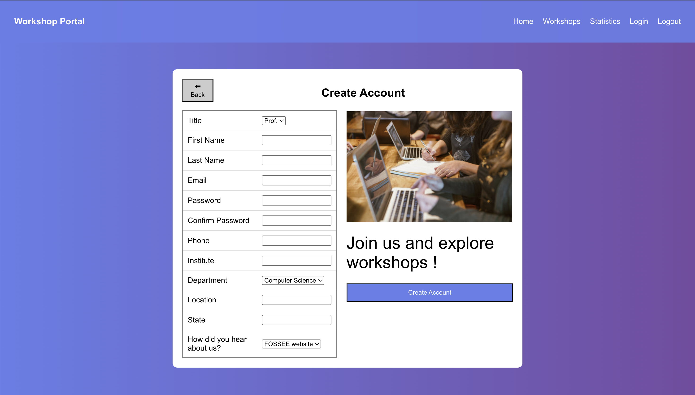
  </a>
  <a href="screenshots/after_home.png">
    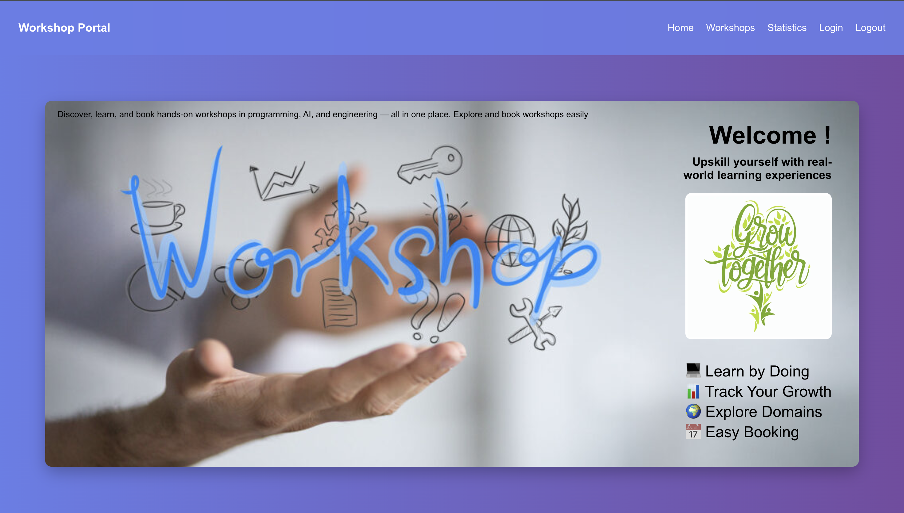
  </a>
  <a href="screenshots/after_filter_1.png">
    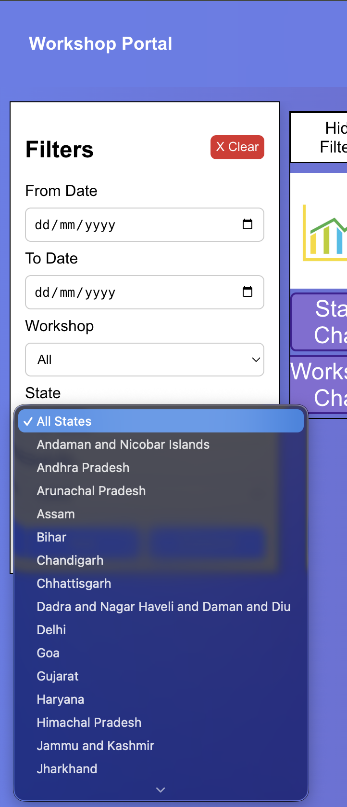
  </a>
  <a href="screenshots/after_workshops.png">
    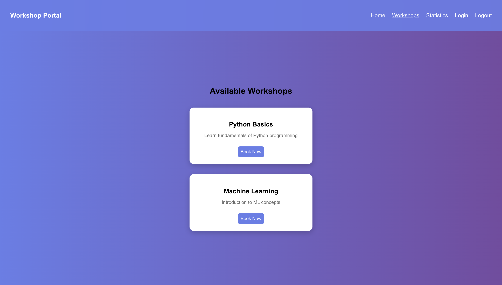
  </a>
  <a href="screenshots/after_statistics_2.png">
    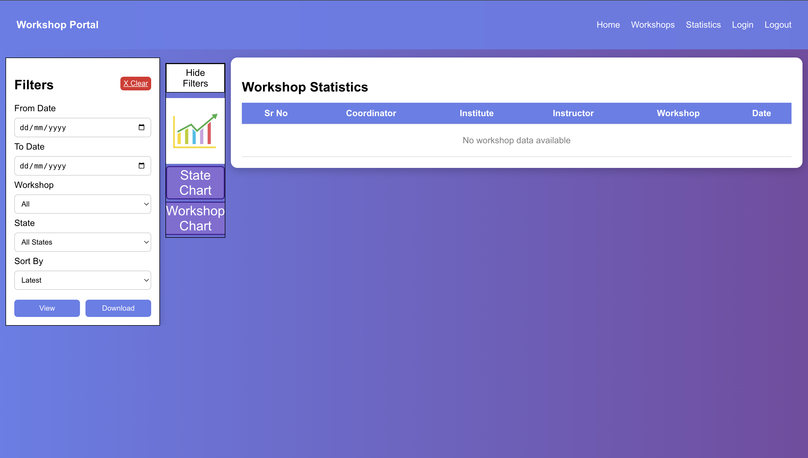
  </a>
  <a href="screenshots/after_filter_2.png">
    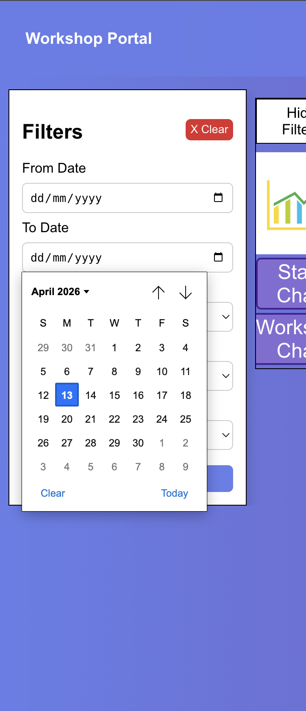
  </a>
  <a href="screenshots/after_state_chart.png">
    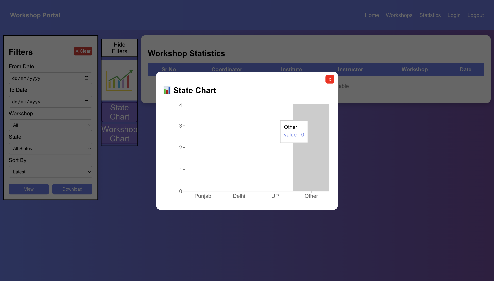
  </a>
  <a href="screenshots/after_statistics_1.png">
    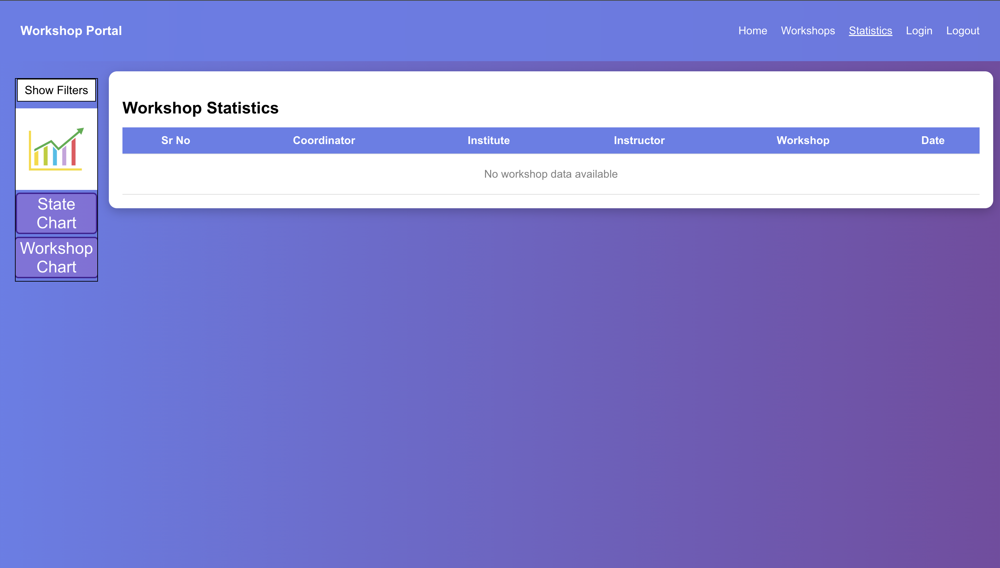
  </a>
  <a href="screenshots/after_workshop_chart.png">
    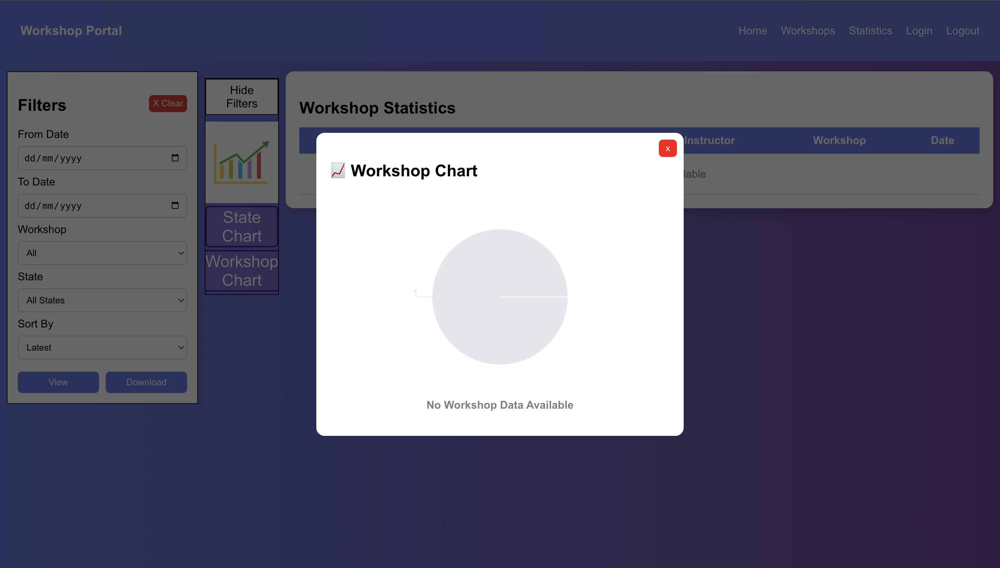
  </a>

---

## 📌 Conclusion
This project enhances the usability and visual appeal of the Workshop Booking system while maintaining its original functionality. The redesign focuses on modern UI practices, responsiveness, and improved user interaction.
